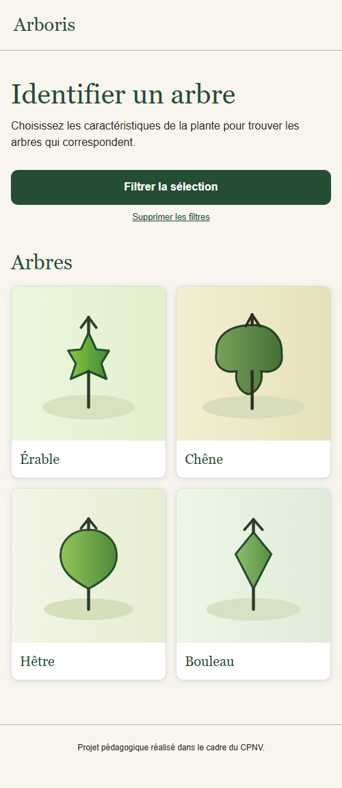
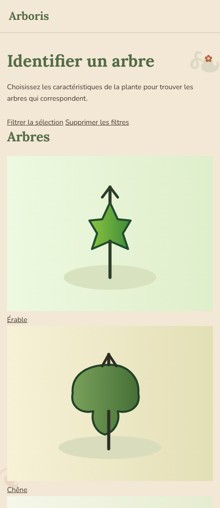
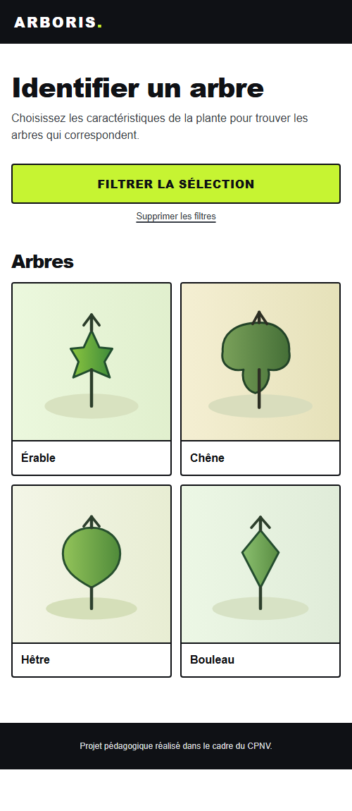

# Dossier design — Arboris

## Recevabilité (grille Note 1)

| Pièce | Fichier | État |
|---|---|---|
| Pitch validé | [pitch.md](pitch.md) | ✅ |
| Persona | [persona.md](persona.md) | ✅ |
| User flow (une tâche) | [user-flow.md](user-flow.md) · [user-flow.jpeg](user-flow.jpeg) | ✅ |
| brief.md sans trou | [brief.md](brief.md) | ✅ |
| Wireframes (≥ 3 mobile + 1 large) | [mobile](wireframe-mobile.jpeg) · [desktop](wireframe-desktop.jpeg) | ✅ |
| 3 maquettes (sobre / chaleureuse / audacieuse) | [code](maquettes/index.html) · [sobre.png](maquettes/sobre.png) · [chaleureuse.png](maquettes/chaleureuse.png) · [audacieuse.png](maquettes/audacieuse.png) | ✅ |
| 3 fiches critiques + choix argumenté | [critique-1](critique/critique-1.md) · [critique-2](critique/critique-2.md) · [critique-3](critique/critique-3.md) · [choix.md](critique/choix.md) | ✅ |
| Contrastes WebAIM notés | [contrastes.md](contrastes.md) | ✅ |
| Observation + une itération avant/après | — | ⏳ test à passer en binôme |

## Résultats des maquettes

| Sobre | Chaleureuse | Audacieuse (retenue) |
|:---:|:---:|:---:|
|  |  |  |
