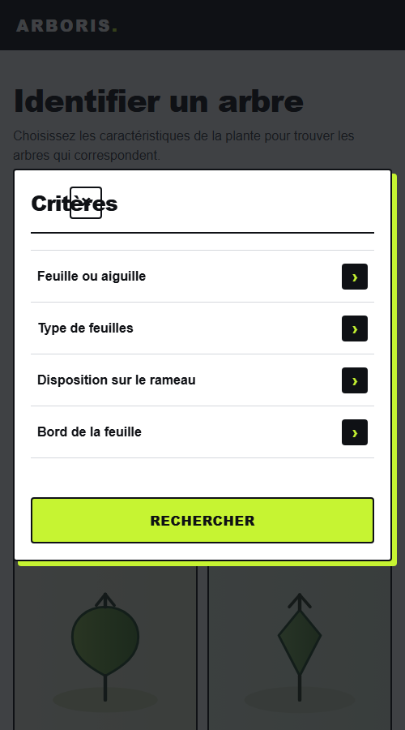
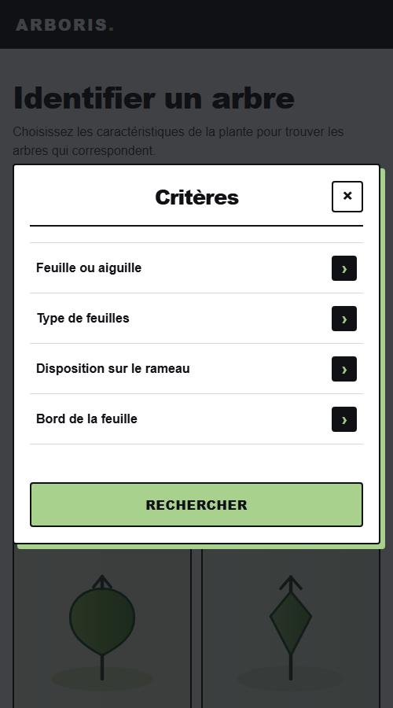
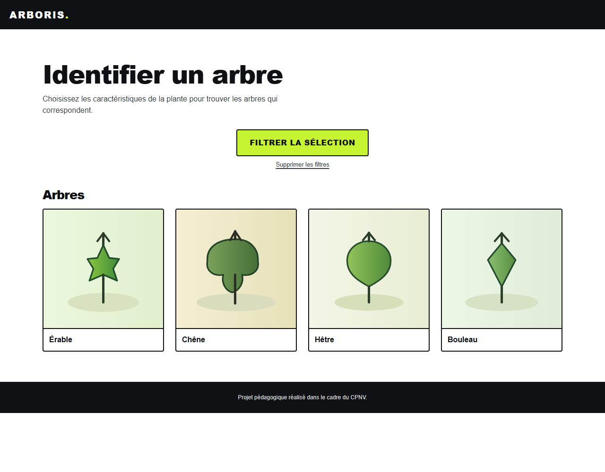
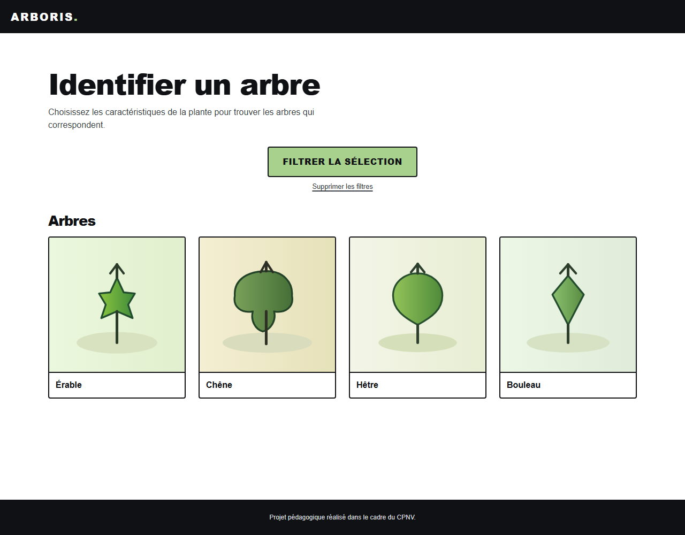

# Itération avant / après

Source : [fiche-observation.md](fiche-observation.md) (testeur : Florian).
Fichier modifié : [maquettes/style/audacieuse.css](maquettes/style/audacieuse.css)

## 1. Vert fluo trop agressif

> « changer couleur verte fluo car trop fluo »

| | Avant | Après |
|---|---|---|
| Couleur d'accent | `#C6F432` (vert fluo) | `#A9D18E` (vert feuille doux) |
| Contraste du bouton (texte noir) | 14,75:1 ✅ | 10,98:1 ✅ |

```css
--accent: #A9D18E;   /* avant : #C6F432 */
```

Le vert est plus doux et plus proche de l'ambiance « nature » du brief. Le bouton reste largement au-dessus du seuil de 4,5:1.

## 2. Croix de fermeture posée sur le titre

> « croix pour refermer la boîte de dialogue critères est sur le texte »

Cause : la boîte de dialogue « Critères » n'a pas de flèche retour. Le titre se plaçait donc dans la 1re colonne de la grille, et la croix dans la 2e, par-dessus le texte.

```css
.dialog-header h2 { grid-column: 2; }
.dialog-close     { grid-column: 3; grid-row: 1; }
```

| Avant | Après |
|:---:|:---:|
|  |  |

## 3. Footer qui flotte au milieu de la page

> « Footer à coller en bas de la page »

```css
body { display: flex; flex-direction: column; min-height: 100vh; }
main { flex: 1; }
```

| Avant | Après |
|:---:|:---:|
|  |  |
